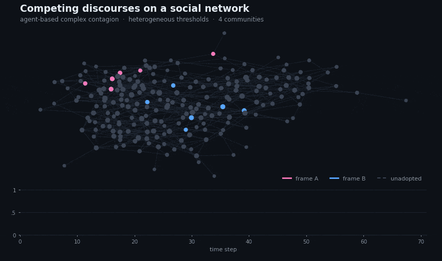

## Hello everyone! 🇨🇱 🇬🇧

I'm a **sociologist and computational social scientist**, currently a **PhD Student (incoming) in Computational Social Science at the London School of Economics (LSE)**, funded by an ANID International Doctoral Scholarship. 

I am trained in both Sociology (BA, MA) and Data Science (MSc), with research interests at the intersection of the two.

🌐 [Website & blog](https://deneken.me) · ✉️ m.deneken@uc.cl · 🤖 [Lab + AI](https://methodolab.com/) 

---

## 🧰 Toolkit

  
  
  
  
  
  

---

---

## 🌱 Currently learning

- Large language models for annotation and framing detection
- Empirical calibration and validation of agent-based models

---

💬 **Ask me about** agent-based modelling · text as data & NLP · political discourse · causal inference · longitudinal survey design 

📫 **Reach me at** m.deneken@uc.cl

---

